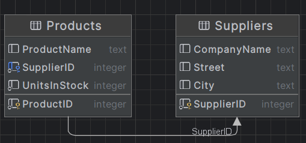
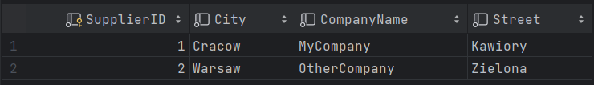
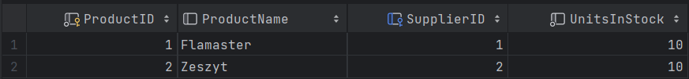
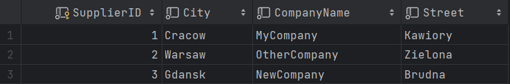
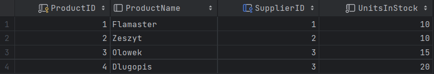
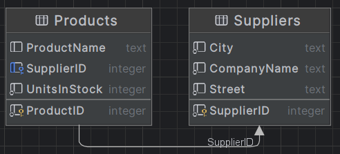
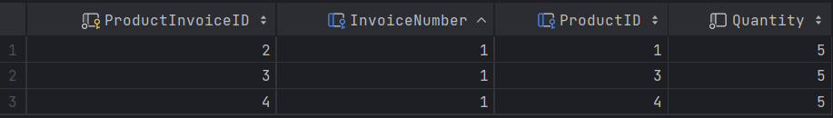
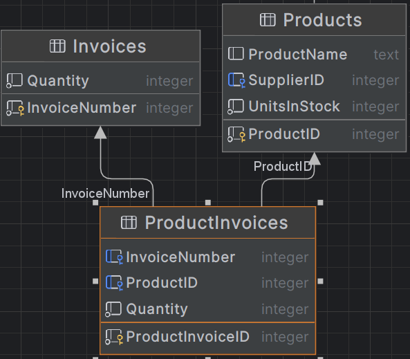

Część samodzielna:
__a. Dodanie dostawcy i ustawienie dostawcy produktu na niego:__

Supplier:
```csharp
public class Supplier
{
    public int SupplierID { get; set; }
    public String CompanyName{ get; set; }
    public String Street{ get; set; }
    public String City{ get; set; }

    public override string ToString()
    {
        return CompanyName;
    }
}
```

Product:
```csharp
public class Product
{
    public int ProductID { get; set; }
    public String? ProductName { get; set; } public
    int UnitsInStock { get; set; }
    public Supplier? Supplier { get; set; }

    public override string ToString()
    {
        return $"{ProductName}: {UnitsInStock} szt.";
    }
}

```

ProdContext:
```csharp
using Microsoft.EntityFrameworkCore;
public class ProdContext : DbContext
{
    public DbSet<Product> Products { get; set; }
    public DbSet<Supplier> Suppliers { get; set; }
    protected override void OnConfiguring(DbContextOptionsBuilder optionsBuilder)
    {
        base.OnConfiguring(optionsBuilder);
        optionsBuilder.UseSqlite("Datasource=MyProductDatabase");
    }
}
```

Program:
```csharp
ProdContext prodContext = new ProdContext();

Product product = new Product { ProductName = "Flamaster", UnitsInStock = 10 };

Supplier supplier = new Supplier { CompanyName = "MyCompany", City = "Cracow", Street = "Kawiory" };

product.Supplier = supplier;

prodContext.Suppliers.Add(supplier);
prodContext.Products.Add(product);
prodContext.SaveChanges();
```
Suupliers:

Products:

Relacja:


__b. Odwrocenie relacji:__

Product:
```csharp
public class Product
{
    public int ProductID { get; set; }
    public String? ProductName { get; set; } public
    int UnitsInStock { get; set; }
    public override string ToString()
    {
        return $"{ProductName}: {UnitsInStock} szt.";
    }
}
```


Supplier:
```csharp
public class Supplier
{
    public int SupplierID { get; set; }
    public String CompanyName{ get; set; }
    public String Street{ get; set; }
    public String City{ get; set; }
    public ICollection<Product> Products { get; set; } = new List<Product>();

    public override string ToString()
    {
        return CompanyName;
    }
}
```


Program:
```csharp
ProdContext prodContext = new ProdContext();

Product product = new Product { ProductName = "Zeszyt", UnitsInStock = 10 };

Supplier supplier = new Supplier { CompanyName = "OtherCompany", City = "Warsaw", Street = "Zielona" };

supplier.Products.Add(product);

prodContext.Suppliers.Add(supplier);
prodContext.Products.Add(product);
prodContext.SaveChanges();
```

Suppliers:

Products:

Relacja:


__c. Relacja dwustronna:__

Do Product spowrotem dodajemy:
```csharp
public Supplier? Supplier { get; set; }  = null;
```


Supplier zostawiamy tak jak jest

Program:
```csharp
ProdContext prodContext = new ProdContext();

Product product1 = new Product { ProductName = "Olowek", UnitsInStock = 15 };
Product product2 = new Product { ProductName = "Dlugopis", UnitsInStock = 20 };

Supplier supplier = new Supplier { CompanyName = "NewCompany", City = "Gdansk", Street = "Brudna" };

supplier.Products.Add(product1);
supplier.Products.Add(product2);
product1.Supplier = supplier;
product2.Supplier = supplier;

prodContext.Suppliers.Add(supplier);
prodContext.Products.Add(product1);
prodContext.Products.Add(product2);

prodContext.SaveChanges();

```
Suppliers:

Products:

Relacja:


__d. Invoice:__

Klasa pomocnicza, ProductInvoice:
```csharp
using System.ComponentModel.DataAnnotations;
using System.ComponentModel.DataAnnotations.Schema;

public class ProductInvoice
{   
    [Key]
    public int ProductInvoiceID { get; set; }
    public int Quantity { get; set; }

    [ForeignKey("ProductID")]
    public Product? Product { get; set; } = null;

    [ForeignKey("InvoiceNumber")]
    public Invoice? Invoice { get; set; } = null;

    public override string ToString()
    {
        return $" {Product.ProductName} {Quantity} szt.";
    }
}
```

Invoice:
```csharp
using System.ComponentModel.DataAnnotations;

public class Invoice
{
    [Key]
    public int InvoiceNumber { get; set; }
    public ICollection<ProductInvoice> ProductInvoices { get; set; } = new List<ProductInvoice>();

    public override string ToString(){
        string result = "-------------------\n";
        result += "Faktura nr " + InvoiceNumber + ":\n";
        int total = 0;
        result += "-------------------\n";
        foreach (var prodInvoice in ProductInvoices)
        {
            result += prodInvoice.Product.ProductName + ": " + prodInvoice.Quantity + " szt.\n";
            total += prodInvoice.Quantity;
        }
        result += "-------------------\n";
        result += "Total quantity: " + total + " szt.\n";
        result += "-------------------\n";

        return result;
    }
    
}
```

Program
```csharp
ProdContext prodContext = new ProdContext();

Invoice invoice = new Invoice {};


var product1 = prodContext.Products.FirstOrDefault(p => p.ProductID == 1);
var productInvoice = new ProductInvoice { Product = product1, Quantity = 5 };
product1.ProductInvoices.Add(productInvoice);
invoice.ProductInvoices.Add(productInvoice);

prodContext.ProductInvoice.Add(productInvoice);

var product3 = prodContext.Products.FirstOrDefault(p => p.ProductID == 3);
productInvoice = new ProductInvoice { Product = product3, Quantity = 5 };
product3.ProductInvoices.Add(productInvoice);
invoice.ProductInvoices.Add(productInvoice);

prodContext.ProductInvoice.Add(productInvoice);

var product4 = prodContext.Products.FirstOrDefault(p => p.ProductID == 4);
productInvoice = new ProductInvoice { Product = product4, Quantity = 5 };
product4.ProductInvoices.Add(productInvoice);
invoice.ProductInvoices.Add(productInvoice);

prodContext.ProductInvoice.Add(productInvoice);

prodContext.Invoices.Add(invoice);


var newInvoice = new Invoice();

var product5 = prodContext.Products.FirstOrDefault(p => p.ProductID == 4);
var productInvoice = new ProductInvoice { Product = product5, Quantity = 15 };

product5.ProductInvoices.Add(productInvoice);
newInvoice.ProductInvoices.Add(productInvoice);

prodContext.ProductInvoices.Add(productInvoice);

var product6 = prodContext.Products.FirstOrDefault(p => p.ProductID == 2);
productInvoice = new ProductInvoice { Product = product6, Quantity = 5 };

product6.ProductInvoices.Add(productInvoice);
newInvoice.ProductInvoices.Add(productInvoice);

prodContext.ProductInvoices.Add(productInvoice);

prodContext.Invoices.Add(newInvoice);

prodContext.SaveChanges();
```

ProductInvoice:

Invoice:

Relacja:


Produkty sprzedane w ramach danej faktury/transakcji:
```csharp
using System.Linq;
using Microsoft.EntityFrameworkCore; 
ProdContext prodContext = new ProdContext();

var myInvoice = prodContext.Invoices.Where(inv => inv.InvoiceNumber == 1).FirstOrDefault();

var prodPerInvoice = prodContext.Invoices.Where(inv =>inv.InvoiceNumber == 1)
    .Include(inv => inv.ProductInvoices)
    .ThenInclude(pi => pi.Product)
    .ToList();

Console.WriteLine(myInvoice);

prodContext.SaveChanges();
```


Faktury w ramach ktory zostal sprzedany dany produkt:
```csharp
using System.Linq;
using Microsoft.EntityFrameworkCore; 
ProdContext prodContext = new ProdContext();

var prodToSearch = prodContext.Products
    .Where(p => p.ProductID == 4)
    .Include(p => p.ProductInvoices)
    .ThenInclude(pi => pi.Invoice)
    .FirstOrDefault();


Console.WriteLine(prodToSearch + " -> id: " + prodToSearch.ProductID);
Console.WriteLine("Invoices:");
foreach (var prodInvoice in prodToSearch.ProductInvoices)
{
    Console.WriteLine("Faktura: " + prodInvoice.Invoice.InvoiceNumber + " -> " + prodInvoice.Quantity + " szt.");

}

prodContext.SaveChanges();

```

