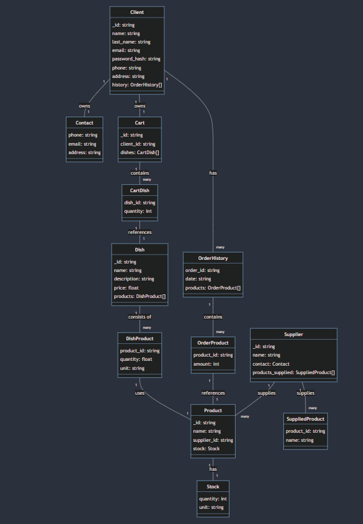

# MiniProject - Restauracja

---

### Imiona i nazwiska autorów : Antoni Dulewicz, Marcin Serafin, Wojciech Wietrzny

---

## Technologie 
### MongoDB, Express, Node.js2
## Tabele 

### Clients
```json
[
    {
    "_id": "client_id",
    "name": "Imie",
    "last_name": "Nazwisko",
    "email": "Imie.Nazwisko@example.com",
    "password_hash": "hashed_password",
    "phone": "123-456-7890",
    "address": "Ulica 1 00-000 Miasto",
    "history": [
        {
            "order_id": "order_id",
            "date": "YYYY-MM-DD",
            "products": [
                {
                    "product_id": "product_id",
                    "amount": 1
                }
            ]
        }
    ]
    }
]
```

### Dishes

``` json
[
{
    "_id": "dish_id",
    "name": "dish name",
    "description": "dish description",
    "price": 12.99,
    "products": [
        {"product_id": "product_id_1","product_name": "name1", "quantity": 200, "unit": "grams"},
        {"product_id": "product_id_2","product_name": "name2", "quantity": 100, "unit": "ml"},
    ]
}
]
```

### Products

```json
[
{
    "_id": "product_id",
    "name": "product name",
    "supplier_id": "supplier_id_1",
    "stock": {
        "quantity": 5000,
        "unit": "grams"
    }
}
]
```

### Suppliers

```json
[
{
    "_id": "supplier_id",
    "name": "supplier name",
    "contact": {
        "phone": "987-654-3210",
        "email": "supplier@exaple.com",
        "address": "Ulica 2 00-000 Miasto"
    },
    "products_supplied": [
        {"product_id": "product_id_1", "name": "product name 1"},
        {"product_id": "product_id_2", "name": "product name 2"},
    ]
}
]
```

### Carts
    
```json
[
{
    "_id": "cart_id",
    "client_id": "client_id",
    "dishes": [
        {"dish_id": "dish_id_1", "quantity": 2},
        {"dish_id": "dish_id_2", "quantity": 1},
    ]
}
]
```
### Orders

```json
[
{
    "_id": "order_id",
    "client_id": "client_id",
    "date": "YYYY-MM-DD",
    "cart": "cart_id",
    "dishes": [
        {"dish_id": "dish_id_1","dish_name":"name1", "quantity": 2,"price": 25.00},
        {"dish_id": "dish_id_2","dish_name":"name1",  "quantity": 1,"price": 12.50},
    ],
    "price": 37.50,
    "address": "Ulica 1 00-000 Miasto",
    "status": "status"
}
]
```

### Deliveries

```json
[
{
    "_id": "delivery_id",
    "supplier_id": "supplier_id",
    "date": "YYYY-MM-DD",
    "products": [
        {"product_id": "product_id_1","product_name":"name1", "amount": 2, "unit": "grams", "price": 50.00},
        {"product_id": "product_id_2","product_name":"name2", "amount": 1, "unit": "ml", "price": 25.00},
    ],
    "Price": 75.00,
    "status": "status"
}
]
```


## Schemat


```js
const ClientSchema = {
    $jsonSchema: {
        bsonType: "object",
        required: ["name", "last_name", "email", "password_hash", "phone", "address"],
        properties: {
            name: {
                bsonType: "string",
                description: "must be a string and is required"
            },
            last_name: {
                bsonType: "string",
                description: "must be a string and is required"
            },
            email: {
                bsonType: "string",
                description: "must be a string and is required"
            },
            password_hash: {
                bsonType: "string",
                description: "must be a string and is required"
            },
            phone: {
                bsonType: "string",
                description: "must be a string and is required"
            },
            address: {
                bsonType: "string",
                description: "must be a string and is required"
            },
            history: {
                bsonType: "array",
                description: "must be an array and is required",
                items: {
                    bsonType: "object",
                    required: ["order_id", "date", "products"],
                    properties: {
                        order_id: {
                            bsonType: "string",
                            description: "must be a string and is required"
                        },
                        date: {
                            bsonType: "date",
                            description: "must be a date and is required"
                        },
                        products: {
                            bsonType: "array",
                            description: "must be an array and is required",
                            items: {
                                bsonType: "object",
                                required: ["product_id", "amount"],
                                properties: {
                                    product_id: {
                                        bsonType: "string",
                                        description: "must be a string and is required"
                                    },
                                    amount: {
                                        bsonType: "int",
                                        description: "must be an int and is required"
                                    }
                                }
                            }
                        }
                    }
                }
            }
        }
    }
}
```
```js
const DishSchema = {
    $jsonSchema: {
        bsonType: "object",
        required: ["name", "description", "price", "products"],
        properties: {
            name: {
                bsonType: "string",
                description: "must be a string and is required"
            },
            description: {
                bsonType: "string",
                description: "must be a string and is required"
            },
            price: {
                bsonType: "double",
                description: "must be a double and is required"
            },
            products: {
                bsonType: "array",
                description: "must be an array and is required",
                items: {
                    bsonType: "object",
                    required: ["product_id","product_name", "quantity", "unit"],
                    properties: {
                        product_id: {
                            bsonType: "string",
                            description: "must be a string and is required"
                        },
                        product_name: {
                            bsonType: "string",
                            description: "must be a string and is required"
                        },
                        quantity: {
                            bsonType: "int",
                            description: "must be an int and is required"
                        },
                        unit: {
                            bsonType: "string",
                            description: "must be a string and is required"
                        }
                    }
                }
            }
        }
    }
}
```
```js
const ProductSchema = {
    $jsonSchema: {
        bsonType: "object",
        required: ["name", "supplier_id", "stock"],
        properties: {
            name: {
                bsonType: "string",
                description: "must be a string and is required"
            },
            supplier_id: {
                bsonType: "string",
                description: "must be a string and is required"
            },
            stock: {
                bsonType: "object",
                required: ["quantity", "unit"],
                properties: {
                    quantity: {
                        bsonType: "int",
                        description: "must be an int and is required"
                    },
                    unit: {
                        bsonType: "string",
                        description: "must be a string and is required"
                    }
                }
            }
        }
    }
}
```
```js
const SupplierSchema = {
    $jsonSchema: {
        bsonType: "object",
        required: ["name", "contact", "products_supplied"],
        properties: {
            name: {
                bsonType: "string",
                description: "must be a string and is required"
            },
            contact: {
                bsonType: "object",
                required: ["phone", "email", "address"],
                properties: {
                    phone: {
                        bsonType: "string",
                        description: "must be a string and is required"
                    },
                    email: {
                        bsonType: "string",
                        description: "must be a string and is required"
                    },
                    address: {
                        bsonType: "string",
                        description: "must be a string and is required"
                    }
                }
            },
            products_supplied: {
                bsonType: "array",
                description: "must be an array and is required",
                items: {
                    bsonType: "object",
                    required: ["product_id", "name"],
                    properties: {
                        product_id: {
                            bsonType: "string",
                            description: "must be a string and is required"
                        },
                        name: {
                            bsonType: "string",
                            description: "must be a string and is required"
                        }
                    }
                }
            }
        }
    }
}
```
```js
const CartSchema = {
    $jsonSchema: {
        bsonType: "object",
        required: ["client_id", "dishes"],
        properties: {
            client_id: {
                bsonType: "string",
                description: "must be a string and is required"
            },
            dishes: {
                bsonType: "array",
                description: "must be an array and is required",
                items: {
                    bsonType: "object",
                    required: ["dish_id", "quantity"],
                    properties: {
                        dish_id: {
                            bsonType: "string",
                            description: "must be a string and is required"
                        },
                        quantity: {
                            bsonType: "int",
                            description: "must be an int and is required"
                        }
                    }
                }
            }
        }
    }
}
```

```js
const OrderSchema = {
    $jsonSchema: {
        bsonType: "object",
        required: ["client_id", "date", "cart", "dishes", "price", "address", "status"],
        properties: {
            client_id: {
                bsonType: "string",
                description: "must be a string and is required"
            },
            date: {
                bsonType: "date",
                description: "must be a date and is required"
            },
            cart: {
                bsonType: "string",
                description: "must be a string and is required"
            },
            dishes: {
                bsonType: "array",
                description: "must be an array and is required",
                items: {
                    bsonType: "object",
                    required: ["dish_id", "dish_name", "quantity", "price"],
                    properties: {
                        dish_id: {
                            bsonType: "string",
                            description: "must be a string and is required"
                        },
                        dish_name: {
                            bsonType: "string",
                            description: "must be a string and is required"
                        },
                        quantity: {
                            bsonType: "int",
                            description: "must be an int and is required"
                        },
                        price: {
                            bsonType: "double",
                            description: "must be a double and is required"
                        }
                    }
                }
            },
            price: {
                bsonType: "double",
                description: "must be a double and is required"
            },
            address: {
                bsonType: "string",
                description: "must be a string and is required"
            },
            status: {
                enum: ["pending", "in progress", "delivered"],
                description: "can only be one of the enum values and is required"
            }
        }
    }
}
```

```js
const DeliverySchema = {
    $jsonSchema: {
        bsonType: "object",
        required: ["supplier_id", "date", "products", "price", "status"],
        properties: {
            supplier_id: {
                bsonType: "string",
                description: "must be a string and is required"
            },
            date: {
                bsonType: "date",
                description: "must be a date and is required"
            },
            products: {
                bsonType: "array",
                description: "must be an array and is required",
                items: {
                    bsonType: "object",
                    required: ["product_id", "product_name", "amount", "unit", "price"],
                    properties: {
                        product_id: {
                            bsonType: "string",
                            description: "must be a string and is required"
                        },
                        product_name: {
                            bsonType: "string",
                            description: "must be a string and is required"
                        },
                        amount: {
                            bsonType: "int",
                            description: "must be an int and is required"
                        },
                        unit: {
                            bsonType: "string",
                            description: "must be a string and is required"
                        },
                        price: {
                            bsonType: "double",
                            description: "must be a double and is required"
                        }
                    }
                }
            },
            price: {
                bsonType: "double",
                description: "must be a double and is required"
            },
            status: {
                enum: ["pending", "in progress", "delivered"],
                description: "can only be one of the enum values and is required"
            }
        }
        
    }
}
```


## Operacje

### CRUD

```js
const { MongoClient } = require('mongodb');

const uri = 'mongodb://localhost:27018';
const client = new MongoClient(uri, { useNewUrlParser: true, useUnifiedTopology: true });
async function connect() {
    try {
        await client.connect();
        console.log('Connected to MongoDB');
    } catch (error) {
        console.error('Error connecting to MongoDB:', error);
    }
}

async function close() {
    try {
        await client.close();
        console.log('MongoDB connection closed');
    } catch (error) {
        console.error('Error closing MongoDB connection:', error);
    }
}

const Products = {
    async create(product) {
        try {
            const database = client.db('RestaurantDataBaseProject');
            const collection = database.collection('Products');
            const result = await collection.insertOne(product);
            return result.insertedId;
        } catch (error) {
            console.error('Error creating product:', error);
            return null;
        }
    },

    async read() {
        try {
            const database = client.db('RestaurantDataBaseProject');
            const collection = database.collection('Products');
            return await collection.find({}).toArray();
        } catch (error) {
            console.error('Error reading products:', error);
            return [];
        }
    },

    async update(id, updates) {
        try {
            const database = client.db('RestaurantDataBaseProject');
            const collection = database.collection('Products');
            await collection.updateOne({ _id: id }, { $set: updates });
            return true;
        } catch (error) {
            console.error('Error updating product:', error);
            return false;
        }
    },

    async delete(id) {
        try {
            const database = client.db('RestaurantDataBaseProject');
            const collection = database.collection('Products');
            await collection.deleteOne({ _id: id });
            return true;
        } catch (error) {
            console.error('Error deleting product:', error);
            return false;
        }
    }
};

const Clients = {
    async create(client) {
        try {
            const database = client.db('RestaurantDataBaseProject');
            const collection = database.collection('Clients');
            const result = await collection.insertOne(client);
            return result.insertedId;
        } catch (error) {
            console.error('Error creating client:', error);
            return null;
        }
    },

    async read() {
        try {
            const database = client.db('RestaurantDataBaseProject');
            const collection = database.collection('Clients');
            return await collection.find({}).toArray();
        } catch (error) {
            console.error('Error reading clients:', error);
            return [];
        }
    },

    async update(id, updates) {
        try {
            const database = client.db('RestaurantDataBaseProject');
            const collection = database.collection('Clients');
            await collection.updateOne({ _id: id }, { $set: updates });
            return true;
        } catch (error) {
            console.error('Error updating client:', error);
            return false;
        }
    },

    async delete(id) {
        try {
            const database = client.db('RestaurantDataBaseProject');
            const collection = database.collection('Clients');
            await collection.deleteOne({ _id: id });
            return true;
        } catch (error) {
            console.error('Error deleting client:', error);
            return false;
        }
    }
};


Carts = {
    async create(cart) {
        try {
            const database = client.db('RestaurantDataBaseProject');
            const collection = database.collection('Carts');
            const result = await collection.insertOne(cart);
            return result.insertedId;
        } catch (error) {
            console.error('Error creating cart:', error);
            return null;
        }
    },

    async read() {
        try {
            const database = client.db('RestaurantDataBaseProject');
            const collection = database.collection('Carts');
            return await collection.find({}).toArray();
        } catch (error) {
            console.error('Error reading carts:', error);
            return [];
        }
    },

    async update(id, updates) {
        try {
            const database = client.db('RestaurantDataBaseProject');
            const collection = database.collection('Carts');
            await collection.updateOne({ _id: id }, { $set: updates });
            return true;
        } catch (error) {
            console.error('Error updating cart:', error);
            return false;
        }
    },

    async delete(id) {
        try {
            const database = client.db('RestaurantDataBaseProject');
            const collection = database.collection('Carts');
            await collection.deleteOne({ _id: id });
            return true;
        } catch (error) {
            console.error('Error deleting cart:', error);
            return false;
        }
    }
};


Deliveries = {
    async create(delivery) {
        try {
            const database = client.db('RestaurantDataBaseProject');
            const collection = database.collection('Deliveries');
            const result = await collection.insertOne(delivery);
            return result.insertedId;
        } catch (error) {
            console.error('Error creating delivery:', error);
            return null;
        }
    },

    async read() {
        try {
            const database = client.db('RestaurantDataBaseProject');
            const collection = database.collection('Deliveries');
            return await collection.find({}).toArray();
        } catch (error) {
            console.error('Error reading deliveries:', error);
            return [];
        }
    },

    async update(id, updates) {
        try {
            const database = client.db('RestaurantDataBaseProject');
            const collection = database.collection('Deliveries');
            await collection.updateOne({ _id: id }, { $set: updates });
            return true;
        } catch (error) {
            console.error('Error updating delivery:', error);
            return false;
        }
    },

    async delete(id) {
        try {
            const database = client.db('RestaurantDataBaseProject');
            const collection = database.collection('Deliveries');
            await collection.deleteOne({ _id: id });
            return true;
        } catch (error) {
            console.error('Error deleting delivery:', error);
            return false;
        }
    }
};


Dishes = {
    async create(dish) {
        try {
            const database = client.db('RestaurantDataBaseProject');
            const collection = database.collection('Dishes');
            const result = await collection.insertOne(dish);
            return result.insertedId;
        } catch (error) {
            console.error('Error creating dish:', error);
            return null;
        }
    },

    async read() {
        try {
            const database = client.db('RestaurantDataBaseProject');
            const collection = database.collection('Dishes');
            return await collection.find({}).toArray();
        } catch (error) {
            console.error('Error reading dishes:', error);
            return [];
        }
    },

    async update(id, updates) {
        try {
            const database = client.db('RestaurantDataBaseProject');
            const collection = database.collection('Dishes');
            await collection.updateOne({ _id: id }, { $set: updates });
            return true;
        } catch (error) {
            console.error('Error updating dish:', error);
            return false;
        }
    },

    async delete(id) {
        try {
            const database = client.db('RestaurantDataBaseProject');
            const collection = database.collection('Dishes');
            await collection.deleteOne({ _id: id });
            return true;
        } catch (error) {
            console.error('Error deleting dish:', error);
            return false;
        }
    }
};


Orders = {
    async create(order) {
        try {
            const database = client.db('RestaurantDataBaseProject');
            const collection = database.collection('Orders');
            const result = await collection.insertOne(order);
            return result.insertedId;
        } catch (error) {
            console.error('Error creating order:', error);
            return null;
        }
    },

    async read() {
        try {
            const database = client.db('RestaurantDataBaseProject');
            const collection = database.collection('Orders');
            return await collection.find({}).toArray();
        } catch (error) {
            console.error('Error reading orders:', error);
            return [];
        }
    },

    async update(id, updates) {
        try {
            const database = client.db('RestaurantDataBaseProject');
            const collection = database.collection('Orders');
            await collection.updateOne({ _id: id }, { $set: updates });
            return true;
        } catch (error) {
            console.error('Error updating order:', error);
            return false;
        }
    },

    async delete(id) {
        try {
            const database = client.db('RestaurantDataBaseProject');
            const collection = database.collection('Orders');
            await collection.deleteOne({ _id: id });
            return true;
        } catch (error) {
            console.error('Error deleting order:', error);
            return false;
        }
    }
};

Suppliers = {
    async create(supplier) {
        try {
            const database = client.db('RestaurantDataBaseProject');
            const collection = database.collection('Suppliers');
            const result = await collection.insertOne(supplier);
            return result.insertedId;
        } catch (error) {
            console.error('Error creating supplier:', error);
            return null;
        }
    },

    async read() {
        try {
            const database = client.db('RestaurantDataBaseProject');
            const collection = database.collection('Suppliers');
            return await collection.find({}).toArray();
        } catch (error) {
            console.error('Error reading suppliers:', error);
            return [];
        }
    },

    async update(id, updates) {
        try {
            const database = client.db('RestaurantDataBaseProject');
            const collection = database.collection('Suppliers');
            await collection.updateOne({ _id: id }, { $set: updates });
            return true;
        } catch (error) {
            console.error('Error updating supplier:', error);
            return false;
        }
    },

    async delete(id) {
        try {
            const database = client.db('RestaurantDataBaseProject');
            const collection = database.collection('Suppliers');
            await collection.deleteOne({ _id: id });
            return true;
        } catch (error) {
            console.error('Error deleting supplier:', error);
            return false;
        }
    }
};

```