---

**Imiona i nazwiska autorów:**

Antoni Dulewicz, Marcin Serafin, Wojciech Wietrzny

--- 
# Temat:
## Hibernate

I:
Product:
```java
package org.example.model;

import jakarta.persistence.*;

import java.util.ArrayList;
import java.util.List;


@Entity
public class Product {
    @Id
    @GeneratedValue(strategy = GenerationType.AUTO)
    private int productID;
    private String productName;
    private int unitsOnStock;
    @ManyToOne
    private Supplier supplier;

    public Product() {
    }

    public Product(String ProductName, int UnitsOnStock, Supplier supplier) {
        this.productName = ProductName;
        this.unitsOnStock = UnitsOnStock;
        this.supplier = supplier;
    }

    public Product(String ProductName, int UnitsOnStock) {
        this.productName = ProductName;
        this.unitsOnStock = UnitsOnStock;
        this.supplier = null;
    }

    public String getSupplier(){
        return supplier.toString();
    }

    public int getProductID() {
        return productID;
    }

    public String getProductName() {
        return productName;
    }

    public String toString() {
        return "Id: " + productID + ", Name: " + productName + ", Units on stock: " + unitsOnStock;
    }

}

```
Supplier:
```java
package org.example.model;

import jakarta.persistence.*;
import java.util.ArrayList;
import java.util.List;

@Entity
public class Supplier {
    @Id
    @GeneratedValue(strategy = GenerationType.AUTO)
    private int supplierID;
    private String companyName;
    private String street;
    private String city;
    public Supplier() {
    }
    public Supplier(String CompanyName, String Street, String City) {
        this.companyName = CompanyName;
        this.street = Street;
        this.city = City;
    }
    public String toString() {
        return "Id: " + supplierID + ", Company name: " + companyName + ", Street: " + street + ", City: " + city;
    }
}
```
Hibernate:
```java
<?xml version='1.0' encoding='utf-8'?>
<!DOCTYPE hibernate-configuration PUBLIC
        "-//Hibernate/Hibernate Configuration DTD 3.0//EN"
        "http://www.hibernate.org/dtd/hibernate-configuration-3.0.dtd">
<hibernate-configuration>
    <session-factory>
        <property
                name="connection.driver_class">org.apache.derby.jdbc.ClientDriver</property>
        <property
                name="connection.url">jdbc:derby://127.0.0.1/SerafinDulewiczWietrznyDataBase;create=true</property>
        <property name="show_sql">true</property>
        <property name="format_sql">true</property>
        <property name="use_sql_comments">true</property>
        <property name="hbm2ddl.auto">create-drop</property>
        <mapping class="org.example.model.Product"></mapping>
        <mapping class="org.example.model.Supplier"></mapping>
        <mapping class="org.example.model.Category"></mapping>
    </session-factory>
</hibernate-configuration>
```

Main:
```java
package org.example;
import org.example.model.Category;
import org.example.model.Product;
import org.example.model.Supplier;
import org.hibernate.Session;
import org.hibernate.SessionFactory;
import org.hibernate.Transaction;
import org.hibernate.cfg.Configuration;
import java.util.List;

public class Main {
    private static SessionFactory sessionFactory = null;

    public static void main(String[] args) {
        sessionFactory = getSessionFactory();
        Session session = sessionFactory.openSession();
        Supplier supplier = new Supplier("Firma", "Ulica", "Miasto");
        Product product1 = new Product("Kredki", 10, supplier);
        Product product2 = new Product("Długopisy", 20, supplier);
        supplier.addProduct(product1);
        supplier.addProduct(product2);
        Transaction tx = session.beginTransaction();
        session.save(supplier);
        session.save(product1);
        session.save(product2);
        tx.commit();
        session.close();
    }
    private static SessionFactory getSessionFactory() {
        if (sessionFactory == null) {
            Configuration configuration = new Configuration();
            sessionFactory = configuration.configure().buildSessionFactory();
        }
        return sessionFactory;
    }
}
```

Product:
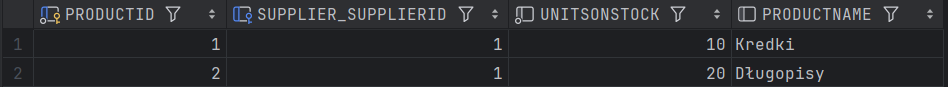
Supplier:

Diagram:
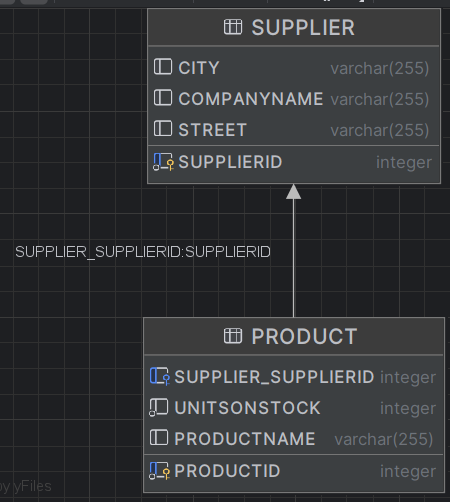

II:
Product:
```java
package org.example.model;

import jakarta.persistence.*;

import java.util.ArrayList;
import java.util.List;


@Entity
public class Product {
    @Id
    @GeneratedValue(strategy = GenerationType.AUTO)
    private int productID;
    private String productName;
    private int unitsOnStock;

    public Product() {
    }

    public Product(String ProductName, int UnitsOnStock) {
        this.productName = ProductName;
        this.unitsOnStock = UnitsOnStock;
    }

    public int getProductID() {
        return productID;
    }

    public String getProductName() {
        return productName;
    }

    public String toString() {
        return "Id: " + productID + ", Name: " + productName + ", Units on stock: " + unitsOnStock;
    }

}
```
Supplier:
```java
package org.example.model;

import jakarta.persistence.*;

import java.util.ArrayList;
import java.util.List;

@Entity
public class Supplier {
    @Id
    @GeneratedValue(strategy = GenerationType.AUTO)
    private int SupplierID;
    private String CompanyName;
    private String Street;
    private String City;
    @OneToMany
    private List<Product> products;

    public Supplier() {
    }

    public Supplier(String CompanyName, String Street, String City, List<Product> products) {
        this.CompanyName = CompanyName;
        this.Street = Street;
        this.City = City;
        this.products = products;
    }

    public Supplier(String CompanyName, String Street, String City) {
        this.CompanyName = CompanyName;
        this.Street = Street;
        this.City = City;
        this.products = new ArrayList<Product>();
    }

    public void addProduct(Product product) {
        products.add(product);
    }
}
```
Main:
```java
package org.example;
import org.example.model.Category;
import org.example.model.Product;
import org.example.model.Supplier;
import org.hibernate.Session;
import org.hibernate.SessionFactory;
import org.hibernate.Transaction;
import org.hibernate.cfg.Configuration;
import java.util.List;

public class Main {
    private static SessionFactory sessionFactory = null;

    public static void main(String[] args) {
        sessionFactory = getSessionFactory();
        Session session = sessionFactory.openSession();
        Supplier supplier = new Supplier("Firma", "Ulica", "Miasto");
        Product product1 = new Product("Kredki", 10);
        Product product2 = new Product("Długopisy", 20);
        supplier.addProduct(product1);
        supplier.addProduct(product2);
        Transaction tx = session.beginTransaction();
        session.save(supplier);
        session.save(product1);
        session.save(product2);
        tx.commit();
        session.close();
    }
    private static SessionFactory getSessionFactory() {
        if (sessionFactory == null) {
            Configuration configuration = new Configuration();
            sessionFactory = configuration.configure().buildSessionFactory();
        }
        return sessionFactory;
    }
}
```

Product:

Supplier:
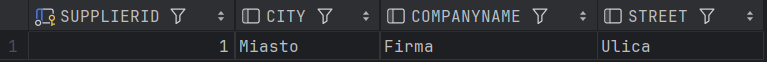
Supplier_Product:
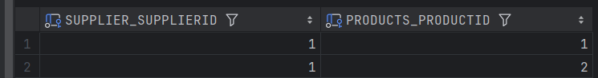
Diagram:


III:
Product:
```java
package org.example.model;

import jakarta.persistence.*;

import java.util.ArrayList;
import java.util.List;


@Entity
public class Product {
    @Id
    @GeneratedValue(strategy = GenerationType.AUTO)
    private int productID;
    private String productName;
    private int unitsOnStock;
    @ManyToOne
    private Supplier supplier;


    public Product() {
    }

    public Product(String ProductName, int UnitsOnStock, Supplier supplier) {
        this.productName = ProductName;
        this.unitsOnStock = UnitsOnStock;
        this.supplier = supplier;
    }
    public Product(String ProductName, int UnitsOnStock) {
        this.productName = ProductName;
        this.unitsOnStock = UnitsOnStock;
        this.supplier = null;
    }

    public String getSupplier(){
        return supplier.toString();
    }

    public int getProductID() {
        return productID;
    }

    public String getProductName() {
        return productName;
    }
    public void setSupplier(Supplier supplier) {
        this.supplier = supplier;
    }

    public String toString() {
        return "Id: " + productID + ", Name: " + productName + ", Units on stock: " + unitsOnStock;
    }

}
```
Supplier:
```java
package org.example.model;

import jakarta.persistence.*;

import java.util.ArrayList;
import java.util.List;

@Entity
public class Supplier {
    @Id
    @GeneratedValue(strategy = GenerationType.AUTO)
    private int SupplierID;
    private String CompanyName;
    private String Street;
    private String City;
    @OneToMany
    private List<Product> products;

    public Supplier() {
    }

    public Supplier(String CompanyName, String Street, String City, List<Product> products) {
        this.CompanyName = CompanyName;
        this.Street = Street;
        this.City = City;
        this.products = products;
    }

    public Supplier(String CompanyName, String Street, String City) {
        this.CompanyName = CompanyName;
        this.Street = Street;
        this.City = City;
        this.products = new ArrayList<Product>();
    }

    public void addProduct(Product product) {
        products.add(product);
    }
}
```
Main:
```java
package org.example;
import org.example.model.Category;
import org.example.model.Product;
import org.example.model.Supplier;
import org.hibernate.Session;
import org.hibernate.SessionFactory;
import org.hibernate.Transaction;
import org.hibernate.cfg.Configuration;
import java.util.List;

public class Main {
    private static SessionFactory sessionFactory = null;

    public static void main(String[] args) {
        sessionFactory = getSessionFactory();
        Session session = sessionFactory.openSession();
        Supplier supplier = new Supplier("Firma", "Ulica", "Miasto");
        Product product1 = new Product("Kredki", 10, supplier);
        Product product2 = new Product("Długopisy", 20);
        product2.setSupplier(supplier);
        supplier.addProduct(product1);
        supplier.addProduct(product2);
        Transaction tx = session.beginTransaction();
        session.save(supplier);
        session.save(product1);
        session.save(product2);
        tx.commit();
        session.close();
    }
    private static SessionFactory getSessionFactory() {
        if (sessionFactory == null) {
            Configuration configuration = new Configuration();
            sessionFactory = configuration.configure().buildSessionFactory();
        }
        return sessionFactory;
    }
}
```

Product:

Supplier:
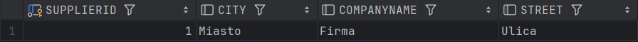
Supplier_Product:

Diagram:
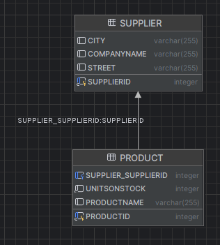


IV:
```java
#Product
package org.example.model;

import jakarta.persistence.*;


@Entity
public class Product {
    @Id
    @GeneratedValue(strategy = GenerationType.AUTO)
    private int ProductID;
    private String ProductName;
    private int UnitsOnStock;
    @ManyToOne
    private Supplier supplier;
    @ManyToOne
    private Category category;


    public Product() {
    }

    public Product(String ProductName, int UnitsOnStock, Supplier supplier, Category category) {
        this.ProductName = ProductName;
        this.UnitsOnStock = UnitsOnStock;
        this.supplier = supplier;
        this.category = category;
    }

    public String getCategory(){
        return category.toString();
    }

    public String toString() {
        return "Id: " + ProductID + ", Name: " + ProductName + ", Units on stock: " + UnitsOnStock;
    }

}
```
```java
#Category
package org.example.model;

import jakarta.persistence.*;

import java.util.ArrayList;
import java.util.List;

@Entity
public class Category {
    @Id
    @GeneratedValue (strategy = GenerationType.AUTO)
    private int CategoryID;
    private String CategoryName;
    @OneToMany
    private List<Product> products;

    public Category() {
    }


    public Category(String CategoryName, List<Product> products) {
        this.CategoryName = CategoryName;
        this.products = products;
    }

    public Category(String CategoryName) {
        this.CategoryName = CategoryName;
        this.products=new ArrayList<Product>();
    }

    public void addProduct(Product product) {
        products.add(product);
    }

    public int getCategoryID() {
        return CategoryID;
    }

    public String toString() {
        return "Id: " + CategoryID + ", Name: " + CategoryName;
    }
    public List<Product> getProducts(){
        return products;
    }
}
```
```java
#Main
package org.example;
import org.example.model.Category;
import org.example.model.Product;
import org.example.model.Supplier;
import org.hibernate.Session;
import org.hibernate.SessionFactory;
import org.hibernate.Transaction;
import org.hibernate.cfg.Configuration;
import java.util.List;

public class Main {
    private static SessionFactory sessionFactory = null;

    public static void main(String[] args) {
        sessionFactory = getSessionFactory();
        Session session = sessionFactory.openSession();
        Category category1 = new Category("Artykuły biurowe");
        Category category2 = new Category("Artykuły szkolne");
        Supplier supplier = new Supplier("Firma", "Ulica", "Miasto");
        Product product1 = new Product("Kredki", 10,supplier, category2);
        Product product2 = new Product("Długopisy", 20, supplier, category1);
        supplier.addProduct(product1);
        supplier.addProduct(product2);
        category1.addProduct(product2);
        category2.addProduct(product1);
        Transaction tx = session.beginTransaction();
        session.save(supplier);
        session.save(product1);
        session.save(product2);
        session.save(category1);
        session.save(category2);
        tx.commit();
        session.close();

        System.out.println(product1.getCategory().toString());
        List<Product> products=category2.getProducts();

        for(Product product:products){
            System.out.println(product.toString());
        }
    }

    private static SessionFactory getSessionFactory() {
        if (sessionFactory == null) {
            Configuration configuration = new Configuration();
            sessionFactory = configuration.configure().buildSessionFactory();
        }
        return sessionFactory;
    }
}
```
Category:
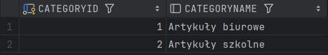
Product:
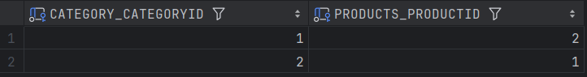
Diagram:

V:
```java
#Product
package org.example.model;

import jakarta.persistence.*;

import java.util.ArrayList;
import java.util.List;


@Entity
public class Product {
    @Id
    @GeneratedValue(strategy = GenerationType.AUTO)
    private int productID;
    private String productName;
    private int unitsOnStock;
    @ManyToOne
    private Supplier supplier;
    @ManyToOne
    private Category category;
    @OneToMany
    private List<ProductInvoice> productInvoices;


    public Product() {
    }

    public Product(String ProductName, int UnitsOnStock, Supplier supplier, Category category, List<ProductInvoice> productInvoices) {
        this.productName = ProductName;
        this.unitsOnStock = UnitsOnStock;
        this.supplier = supplier;
        this.category = category;
        this.productInvoices = productInvoices;
    }

    public Product(String ProductName, int UnitsOnStock, Supplier supplier, Category category) {
        this.productName = ProductName;
        this.unitsOnStock = UnitsOnStock;
        this.supplier = supplier;
        this.category = category;
        this.productInvoices = new ArrayList<ProductInvoice>();
    }
    public String getCategory(){
        return category.toString();
    }

    public String getSupplier(){
        return supplier.toString();
    }

    public int getProductID() {
        return productID;
    }

    public String getProductName() {
        return productName;
    }

    public void addProductInvoice(ProductInvoice productInvoice) {
        productInvoices.add(productInvoice);
    }

    public String toString() {
        return "Id: " + productID + ", Name: " + productName + ", Units on stock: " + unitsOnStock;
    }

}

```
```java
#ProductInvoice
package org.example.model;

import jakarta.persistence.*;

@Entity
public class ProductInvoice {
    @Id
    @GeneratedValue(strategy = GenerationType.AUTO)
    private int ProductInvoiceID;
    @OneToOne
    private Product Product;
    private int Quantity;
    @OneToOne
    private Invoice Invoice;

    public ProductInvoice() {
    }

    public ProductInvoice(Product Product, int Quantity, Invoice Invoice) {
        this.Product = Product;
        this.Quantity = Quantity;
        this.Invoice = Invoice;
    }

    public int getQuantity() {
        return Quantity;
    }

    public Product getProduct() {
        return Product;
    }

    public String  toString() {
        return Product+ ": " + Quantity + " szt";
    }
}

```
```java
#Invoice
package org.example.model;

import jakarta.persistence.*;

import java.util.ArrayList;

import java.util.List;

@Entity
public class Invoice {
    @Id
    @GeneratedValue(strategy = GenerationType.AUTO)
    private int InvoiceID;
    private String invoiceNumber;
    @OneToMany
    private List<ProductInvoice> productInvoices;

    public Invoice() {
    }

    public Invoice(String InvoiceNumber, List<ProductInvoice> productInvoices) {
        this.invoiceNumber = InvoiceNumber;
        this.productInvoices = productInvoices;
    }

    public Invoice(String InvoiceNumber) {
        this.invoiceNumber = InvoiceNumber;
        this.productInvoices = new ArrayList<ProductInvoice>();
    }

    public void addProductInvoice(ProductInvoice productInvoice) {
        productInvoices.add(productInvoice);
    }

    public String toString() {
        String result = "-------------------\n";
        result += "Faktura nr " + invoiceNumber + ":\n";
        int total = 0;
        result += "-------------------\n";
        for(ProductInvoice prodInvoice: productInvoices)
        {
            result += prodInvoice.getProduct().getProductName() + ": " + prodInvoice.getQuantity() + " szt.\n";
            total += prodInvoice.getQuantity();
        }
        result += "-------------------\n";
        result += "Total quantity: " + total + " szt.\n";
        result += "-------------------\n";

        return result;
    }

}
```
```java
#Main
package org.example;
import org.example.model.*;
import org.hibernate.Session;
import org.hibernate.SessionFactory;
import org.hibernate.Transaction;
import org.hibernate.cfg.Configuration;
import java.util.List;

public class Main {
    private static SessionFactory sessionFactory = null;

    public static void main(String[] args) {
        sessionFactory = getSessionFactory();
        Session session = sessionFactory.openSession();
        Invoice invoice1 = new Invoice("FV 2021/01");
        Invoice invoice2 = new Invoice("FV 2021/02");
        Category category1 = new Category("Artykuły biurowe");
        Category category2 = new Category("Artykuły szkolne");
        Supplier supplier = new Supplier("Firma", "Ulica", "Miasto");
        Product product1 = new Product("Kredki", 10,supplier, category2);
        Product product2 = new Product("Długopisy", 20, supplier, category1);
        ProductInvoice productInvoice1 = new ProductInvoice(product1, 5, invoice1);
        ProductInvoice productInvoice2 = new ProductInvoice(product2, 10, invoice2);
        invoice1.addProductInvoice(productInvoice1);
        invoice2.addProductInvoice(productInvoice2);
        product1.addProductInvoice(productInvoice1);
        product2.addProductInvoice(productInvoice2);
        supplier.addProduct(product1);
        supplier.addProduct(product2);
        category1.addProduct(product2);
        category2.addProduct(product1);
        Transaction tx = session.beginTransaction();
        session.save(invoice1);
        session.save(invoice2);
        session.save(productInvoice1);
        session.save(productInvoice2);
        session.save(supplier);
        session.save(product1);
        session.save(product2);
        session.save(category1);
        session.save(category2);
        tx.commit();
        session.close();

        System.out.println(product1.getCategory().toString());
        List<Product> products=category2.getProducts();

        for(Product product:products){
            System.out.println(product.toString());
        }
    }

    private static SessionFactory getSessionFactory() {
        if (sessionFactory == null) {
            Configuration configuration = new Configuration();
            sessionFactory = configuration.configure().buildSessionFactory();
        }
        return sessionFactory;
    }
}
```
Invoice:

ProductInvoice:

Product:_ProductInvoice:

Invoice:_ProductInvoice:

Diagram:
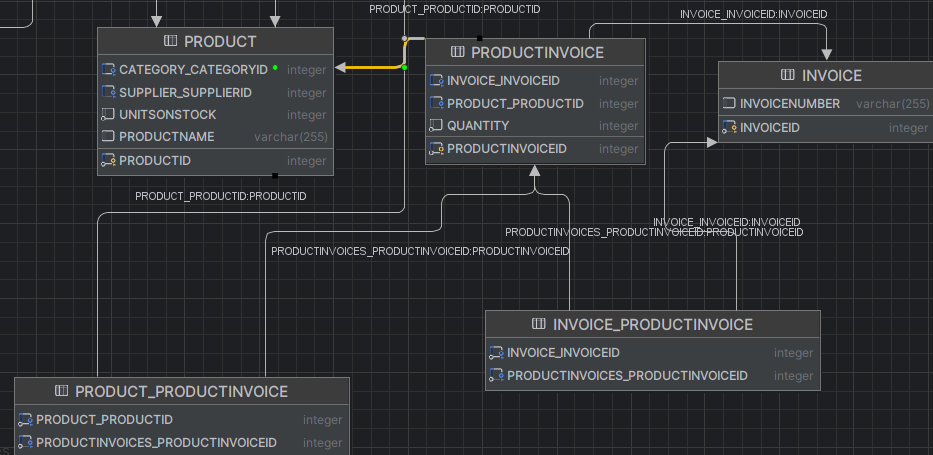
VI:
```java
```

VI:
Main:
```java
package org.example;

import jakarta.persistence.*;
import org.example.model.*;

public class Main {
    public static void main(String[] args) {
        EntityManagerFactory entityManagerFactory = Persistence.createEntityManagerFactory("myPersistenceUnit");
        EntityManager entityManager = entityManagerFactory.createEntityManager();

        EntityTransaction tx = entityManager.getTransaction();
        tx.begin();

        Invoice invoice1 = new Invoice("FV 2021/01");
        Invoice invoice2 = new Invoice("FV 2021/02");
        Category category1 = new Category("Artykuły biurowe");
        Category category2 = new Category("Artykuły szkolne");
        Supplier supplier = new Supplier("Firma", "Ulica", "Miasto");
        Product product1 = new Product("Kredki", 10, supplier, category2);
        Product product2 = new Product("Długopisy", 20, supplier, category1);
        Product product3 = new Product("Papier", 100, supplier, category1);
        ProductInvoice productInvoice1 = new ProductInvoice(product1, 5, invoice1);
        ProductInvoice productInvoice2 = new ProductInvoice(product2, 10, invoice2);

        invoice1.addProductInvoice(productInvoice1);
        invoice2.addProductInvoice(productInvoice2);
        supplier.addProduct(product1);
        supplier.addProduct(product2);
        category1.addProduct(product2);
        category2.addProduct(product1);

        entityManager.persist(invoice1);
        entityManager.persist(invoice2);
        entityManager.persist(productInvoice1);
        entityManager.persist(productInvoice2);
        entityManager.persist(supplier);
        entityManager.persist(product1);
        entityManager.persist(product2);
        entityManager.persist(product3);
        entityManager.persist(category1);
        entityManager.persist(category2);

        tx.commit();
        entityManager.close();
        entityManagerFactory.close();
    }
}
```
Persistence.xml: (Dawniej hibernate.cfg.xml)
```xml
<?xml version="1.0" encoding="UTF-8"?>
<persistence xmlns="http://xmlns.jcp.org/xml/ns/persistence"
             xmlns:xsi="http://www.w3.org/2001/XMLSchema-instance"
             xsi:schemaLocation="http://xmlns.jcp.org/xml/ns/persistence
             http://xmlns.jcp.org/xml/ns/persistence/persistence_2_2.xsd"
             version="2.2">
    <persistence-unit name="myPersistenceUnit" transaction-type="RESOURCE_LOCAL">
        <provider>org.hibernate.jpa.HibernatePersistenceProvider</provider>
        <properties>
            <!-- Dostawca bazy danych -->
            <property name="jakarta.persistence.jdbc.driver" value="org.apache.derby.jdbc.ClientDriver"/>
            <property name="jakarta.persistence.jdbc.url" value="jdbc:derby://127.0.0.1/SerafinDulewiczWietrznyJPADataBase;create=true"/>
            <!-- Własności Hibernate -->
            <property name="hibernate.show_sql" value="true"/>
            <property name="hibernate.format_sql" value="true"/>
            <property name="hibernate.use_sql_comments" value="true"/>
            <property name="hibernate.hbm2ddl.auto" value="update"/>
            <!-- Dodatkowe właściwości -->
            <!-- Tutaj możesz dodać inne właściwości -->
        </properties>
    </persistence-unit>
</persistence>
```

VII:
W relacjach OneToMany i ManyToOne dodano atrybut cascade = CascadeType.ALL, 
który oznacza, że operacje (takie jak persist, merge, remove) wykonywane na jednej instancji będą propagowane na związne z nią instancje.
Użyto również orphanRemoval = true, co oznacza, że gdy jedna strona relacji zostanie usunięta, to powiązane instancje zostaną również usunięte automatycznie.
Invoice:
```java
package org.example.model;

import jakarta.persistence.*;

import java.util.ArrayList;

import java.util.List;

@Entity
public class Invoice {
    @Id
    @GeneratedValue(strategy = GenerationType.AUTO)
    private int InvoiceID;
    private String invoiceNumber;
    @OneToMany(mappedBy = "Invoice", cascade = CascadeType.ALL, orphanRemoval = true)
    private List<ProductInvoice> productInvoices;

    public Invoice() {
    }

    public Invoice(String InvoiceNumber) {
        this.invoiceNumber = InvoiceNumber;
        this.productInvoices = new ArrayList<ProductInvoice>();
    }

    public void addProductInvoice(ProductInvoice productInvoice) {

        productInvoices.add(productInvoice);
        productInvoice.setInvoice(this);
    }

    public String toString() {
        String result = "-------------------\n";
        result += "Faktura nr " + invoiceNumber + ":\n";
        int total = 0;
        result += "-------------------\n";
        for(ProductInvoice prodInvoice: productInvoices)
        {
            result += prodInvoice.getProduct().getProductName() + ": " + prodInvoice.getQuantity() + " szt.\n";
            total += prodInvoice.getQuantity();
        }
        result += "-------------------\n";
        result += "Total quantity: " + total + " szt.\n";
        result += "-------------------\n";

        return result;
    }

}
```
ProductInvoice:
```java
package org.example.model;

import jakarta.persistence.*;

@Entity
public class ProductInvoice {
    @Id
    @GeneratedValue(strategy = GenerationType.AUTO)
    private int ProductInvoiceID;
    @ManyToOne
    private Product Product;
    private int Quantity;
    @ManyToOne
    private Invoice Invoice;

    public ProductInvoice() {
    }

    public ProductInvoice(Product Product, int Quantity, Invoice Invoice) {
        this.Product = Product;
        this.Quantity = Quantity;
        this.Invoice = Invoice;
    }


    public Invoice setInvoice(Invoice invoice) {
        return this.Invoice = invoice;
    }

    public Product setProduct(Product product) {return this.Product = product;}

    public int getQuantity() {
        return Quantity;
    }

    public Product getProduct() {
        return Product;
    }

    public String  toString() {
        return Product+ ": " + Quantity + " szt";
    }
}
```
Product:
```java
package org.example.model;

import jakarta.persistence.*;

import java.util.ArrayList;
import java.util.List;


@Entity
public class Product {
    @Id
    @GeneratedValue(strategy = GenerationType.AUTO)
    private int productID;
    private String productName;
    private int unitsOnStock;
    @ManyToOne
    private Supplier supplier;
    @ManyToOne
    private Category category;
    @OneToMany(mappedBy = "product", cascade = CascadeType.ALL, orphanRemoval = true)
    private List<ProductInvoice> productInvoices;


    public Product() {
    }


    public Product(String ProductName, int UnitsOnStock, Supplier supplier, Category category) {
        this.productName = ProductName;
        this.unitsOnStock = UnitsOnStock;
        this.supplier = supplier;
        this.category = category;
        this.productInvoices = new ArrayList<ProductInvoice>();
    }
    public String getCategory(){
        return category.toString();
    }

    public String getSupplier(){
        return supplier.toString();
    }

    public int getProductID() {
        return productID;
    }

    public String getProductName() {
        return productName;
    }

    public void addProductInvoice(ProductInvoice productInvoice) {

        productInvoices.add(productInvoice);
        productInvoice.setProduct(this);
    }

    public String toString() {
        return "Id: " + productID + ", Name: " + productName + ", Units on stock: " + unitsOnStock;
    }

}
```

VIII:
a:
Address:
```java
package org.example.model;

import jakarta.persistence.Embeddable;

@Embeddable
public class Address {
    private String street;
    private String city;

    public Address() {
    }

    public Address(String street, String city) {
        this.street = street;
        this.city = city;
    }

    public String getStreet() {
        return street;
    }

    public String getCity() {
        return city;
    }

    public String toString() {
        return street + ", " + city;
    }
}
```
Supplier:
```java
package org.example.model;

import jakarta.persistence.*;

import java.util.ArrayList;
import java.util.List;

@Entity
public class Supplier {
    @Id
    @GeneratedValue(strategy = GenerationType.AUTO)
    private int supplierID;
    private String companyName;
    @Embedded
    private Address address;
    @OneToMany
    private List<Product> products;
    public Supplier() {
    }
    public Supplier(String CompanyName, Address address) {
        this.companyName = CompanyName;
        this.address = address;
        this.products = new ArrayList<Product>();
    }
    public void addProduct(Product product) {
        products.add(product);
        product.setSupplier(this);
    }
}
```
IX:
TABLE_PER_CLASS:
Company:
package org.example.model;

import jakarta.persistence.*;

@Entity
@Inheritance(strategy = InheritanceType.TABLE_PER_CLASS)
public class Company {
    @Id
    @GeneratedValue(strategy = GenerationType.AUTO)
    private int CompanyID;
    private String companyName;
    @Embedded       
    private Address address;
    private String zipCode;

    public Company() {
    }

    public Company(String companyName, Address address, String zipCode) {
        this.companyName = companyName;
        this.address = address;
        this.zipCode = zipCode;
    }

    public String getCompanyName() {
        return companyName;
    }
}
```
Supplier:
```java
package org.example.model;

import jakarta.persistence.*;

import java.util.ArrayList;
import java.util.List;

@Entity
public class Supplier extends Company {
    int BankAccountNumber;
    @OneToMany
    private List<Product> products;
    public Supplier() {
    }
    public Supplier(int bankAccountNumber, String companyName, Address address,String zipCode) {
        super(companyName, address,zipCode);
        this.BankAccountNumber = bankAccountNumber;
        this.products = new ArrayList<Product>();
    }
    public void addProduct(Product product) {
        products.add(product);
        product.setSupplier(this);
    }
}
```java
Customer:
package org.example.model;


import jakarta.persistence.*;

@Entity
public class Customer extends Company {
    float discount;

    public Customer() {
    }
    public Customer(String companyName, Address address, String zipCode, float discount) {
        super(companyName, address, zipCode);
        this.discount = discount;
    }
}
```


Single_Table:
Company:
```java
package org.example.model;

import jakarta.persistence.*;

@Entity
@Inheritance(strategy = InheritanceType.SINGLE_TABLE)
public class Company {
    @Id
    @GeneratedValue(strategy = GenerationType.AUTO)
    private int CompanyID;
    private String companyName;
    @Embedded
    private Address address;
    private String zipCode;

    public Company() {
    }

    public Company(String companyName, Address address, String zipCode) {
        this.companyName = companyName;
        this.address = address;
        this.zipCode = zipCode;
    }

    public String getCompanyName() {
        return companyName;
    }
}
```

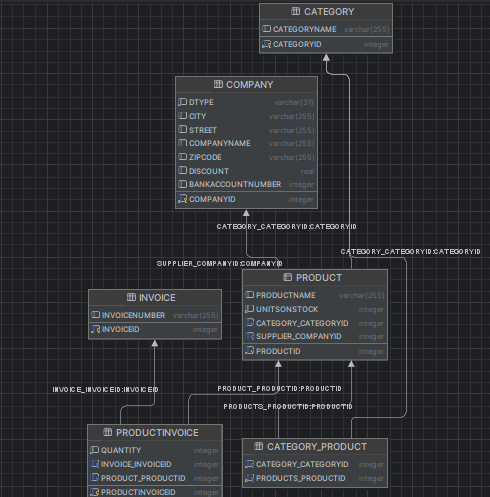


Joined:
Company:
```java
package org.example.model;

import jakarta.persistence.*;

@Entity
@Inheritance(strategy = InheritanceType.JOINED)
public class Company {
    @Id
    @GeneratedValue(strategy = GenerationType.AUTO)
    private int CompanyID;
    private String companyName;
    @Embedded
    private Address address;
    private String zipCode;

    public Company() {
    }

    public Company(String companyName, Address address, String zipCode) {
        this.companyName = companyName;
        this.address = address;
        this.zipCode = zipCode;
    }

    public String getCompanyName() {
        return companyName;
    }
}
```


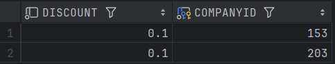
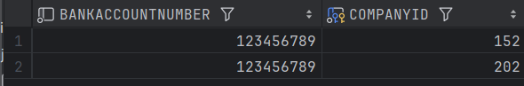
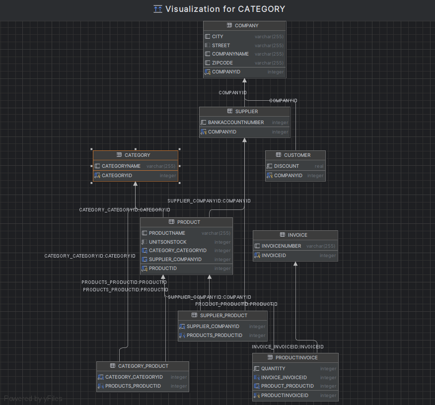